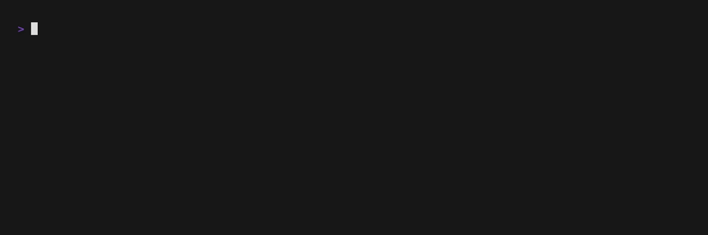
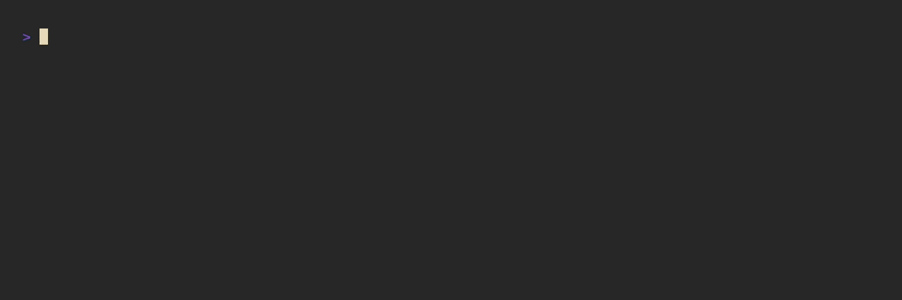
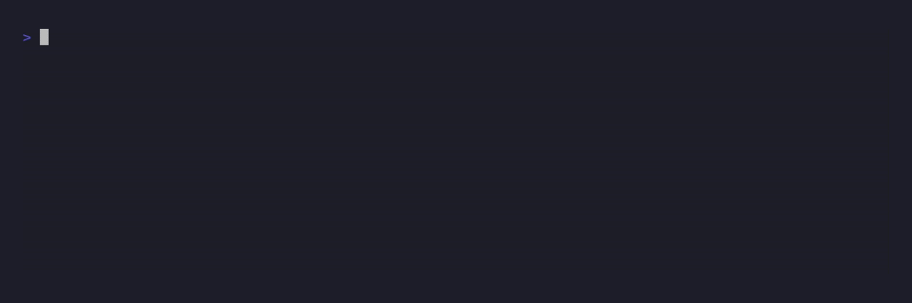

# Theming

IntelliShell's appearance is fully customizable, allowing you to tailor the colors and styles of the Terminal User
Interface (TUI) to perfectly match your terminal's color scheme. All theming options are configured within the `[theme]`
section of your `config.toml` file.

## Style Formatting

Styles are defined using a string that combines optional modifiers with an optional color. For example, a style for an
important but subdued text might be `"bold italic yellow"`.

### Supported Modifiers

You can apply one or more of the following text attributes:

- `bold`
- `dim`
- `italic`
- `underline`

### Supported Colors

Colors can be specified in several formats:

- **Named Colors**: Standard ANSI colors like `black`, `red`, `green`, `dark yellow`, etc
- **RGB**: `rgb(15, 15, 15)`
- **Hexadecimal**: `#112233`
- **ANSI 8-bit Index**: An [integer from `0` to `255`](https://jonasjacek.github.io/colors/) as a string (e.g., `"8"`)
- **Default**: Use `default` or an empty string (`""`) to inherit your terminal's colors

## Configuration Options

Here is a breakdown of each available key in the `[theme]` section.

| Key                  | Description                                                                    |
| -------------------- | ------------------------------------------------------------------------------ |
| `primary`            | The main style for elements like selected items or important text              |
| `secondary`          | A less prominent style, often used for unselected items                        |
| `accent`             | Used to draw attention to specific parts of the text, like aliases             |
| `comment`            | The style for descriptions and explanatory text                                |
| `error`              | The style used to display error messages                                       |
| `highlight`          | The background color for the highlighted item in a list (use `"none"` to skip) |
| `highlight_symbol`   | The character(s) displayed to the left of the highlighted item                 |
| `highlight_primary`  | Overrides the `primary` style for the highlighted item only                    |
| `highlight_secondary`| Overrides the `secondary` style for the highlighted item only                  |
| `highlight_accent`   | Overrides the `accent` style for the highlighted item only                     |
| `highlight_comment`  | Overrides the `comment` style for the highlighted item only                    |

### Default Configuration

```toml
{{#include ../../../default_config.toml:117:152}}
```

## Sample Themes

The IntelliShell repository includes several pre-made themes to get you started.

### Arcade

A playful variation on the default theme, bringing a vibrant and retro feel to your terminal.



```toml
{{#include ../../../vhs/themes/arcade.toml}}
```

### Gruvbox

A theme inspired by the popular [Gruvbox](https://github.com/morhetz/gruvbox) color scheme, featuring a warm, retro feel.



```toml
{{#include ../../../vhs/themes/gruvbox.toml}}
```

### Nord

A theme based on the arctic, north-bluish color palette of [Nord](https://www.nordtheme.com/).


```toml
{{#include ../../../vhs/themes/nord.toml}}
```

### Dracula

A theme based on the dark and modern [Dracula](https://draculatheme.com/) color scheme.



```toml
{{#include ../../../vhs/themes/dracula.toml}}
```

---

Now that your interface looks just right, you can fine-tune how it behaves. Let's move on to
[**Search Tuning**](./search_tuning.md).
